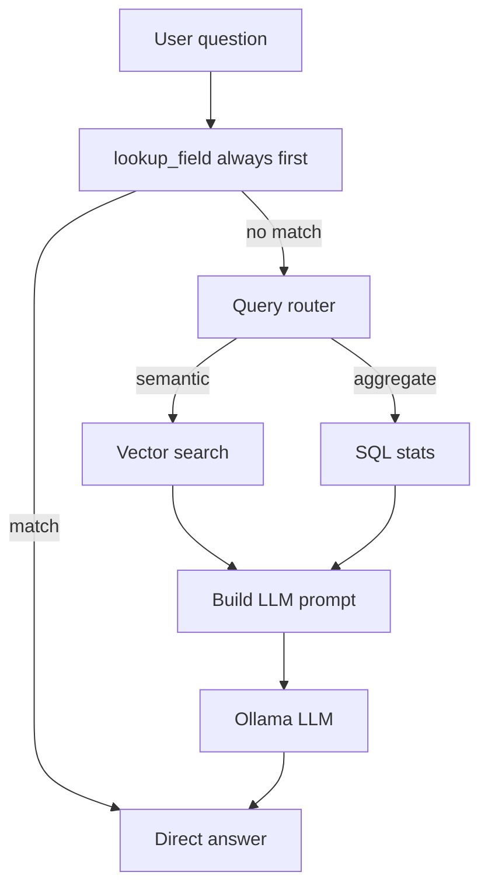

# Agent Layer

How the system answers questions, summarizes forms, and analyzes multiple forms. This is **Stage 3** of the pipeline.

## Overview

All LLM calls go through **Ollama** locally — no cloud APIs.

---

## Components

| File | Class / Function | Purpose |
|------|------------------|---------|
| `src/agent/llm_client.py` | `OllamaClient` | HTTP client for Ollama `/api/chat` |
| `src/agent/router.py` | `classify_query()` | Route question to lookup/semantic/aggregate |
| `src/agent/field_lookup.py` | `lookup_field()` | Direct answers for known field patterns |
| `src/agent/prompt_utils.py` | `form_context_for_llm()` | LLM context without noisy `raw_text` |
| `src/agent/qa.py` | `FormQA` | Single-form question answering |
| `src/agent/summarizer.py` | `FormSummarizer` | Form summaries (LLM + structured markdown) |
| `src/ui/summary_view.py` | `render_summary_cards()` | Streamlit blue/white section-card UI |
| `src/agent/multi_form.py` | `MultiFormAnalyzer` | Cross-form analytics |

---

## Direct field lookup (`field_lookup.py`)

**Always runs first** — before vector search or LLM. Returns instant, authoritative answers from structured JSON.

Supported question types:

| Category | Examples |
|----------|----------|
| Patient | name, DOB, gender, member ID, group number, phone |
| Providers | requesting/service name, NPI, phone, PCP, contact |
| Review / request | urgent, non-urgent, initial, extension |
| Setting | inpatient, outpatient, service setting |
| Therapy | type, sessions, duration |
| Procedures | CPT codes, ICD codes, procedure list |
| Other | issuer, submission date, clinical address |

**Important:** Setting is checked before gender so *"is he inpatient or outpatient"* maps to setting, not gender.

Works in CLI (`--no-llm`), Streamlit UI (no Ollama needed), and as the first step in `FormQA.answer()`.

---

## Query router

`classify_query(question)` uses regex patterns:

| Route | Triggers | Handler |
|-------|----------|---------|
| `lookup` | member id, patient name, npi, urgent, setting, therapy, gender, etc. | Direct field lookup |
| `aggregate` | "how many", "across", "all forms", "compare" | Multi-form SQL + LLM |
| `semantic` | everything else | Vector search + LLM |

---

## Single-form Q&A (`FormQA`)

**Command:** `python -m src.cli ask "QUESTION" --form <form_id>`

### Flow

1. Load `FormDocument` from `data/processed/<form_id>.json`
2. **Try `lookup_field()`** — return immediately if matched
3. Classify query route for semantic/aggregate fallback
4. `vector_index.search(question, form_id, top_k=5)` — excludes legacy raw OCR chunks
5. Build prompt with:
   - Retrieved chunks
   - **Key fields summary** (authoritative structured fields)
   - Structured JSON (**without** `raw_text`)
6. `OllamaClient.generate()` with medical form system prompt

### System prompt highlights

- Prefer Key fields summary and structured JSON over context chunks
- Checkbox fields (setting, review_type, gender, therapies) in JSON are authoritative
- Ignore OCR artifacts like `[ 7 ]` or `| Label` in chunks

### `--no-llm` mode

Only `lookup_field()` runs. Useful for verifying extraction without LLM variability.

---

## Summarization (`FormSummarizer`)

**Command:** `python -m src.cli summarize --form <form_id>`

Uses `form_context_for_llm()` — sends structured JSON + key fields summary, **not** raw OCR text.

### Without LLM (`--no-llm`)

`summarize_structured()` builds a sectioned markdown summary directly from JSON fields:
- Sections: Patient (name, **Member ID**, DOB, gender, phone), Request, Providers, Services (Clinical when present)
- Human-readable labels (`non_urgent` → Non-Urgent, `physical_therapy` → Physical Therapy)
- Formatted dates (`Nov 20, 2022`), procedure tables with Code/ICD columns

### Streamlit UI (`summary_view.py`)

Click **Summarize** in the Ask section. The UI:
1. Sets session state and reruns
2. Renders `render_summary_cards()` **below the Ask / Summarize buttons** (after metrics and Full extracted JSON)
3. Shows blue header, section cards (Patient includes **Member ID**), **two-column Providers (Section IV)** with phone/fax, badges, and a procedures table

CLI uses markdown; Streamlit uses the card layout. Both read the same `FormDocument` fields.

**Batch tab — Forms in index** table includes `member_id` alongside patient, review type, setting, and provider.

See [UI Guide](ui-guide.md) for the full Streamlit walkthrough.

---

## Multi-form analytics (`MultiFormAnalyzer`)

**Command:** `python -m src.cli analyze-all --question "..."`

### Structured stats (`default_stats()`)

| Stat | SQL |
|------|-----|
| Total forms | `COUNT(*)` |
| Review type breakdown | `GROUP BY review_type` |
| Request type breakdown | `GROUP BY request_type` |
| **Service setting breakdown** | `GROUP BY setting` |
| Top providers | `GROUP BY requesting_provider ORDER BY cnt DESC` |
| Patient list | `form_id, patient_name, member_id, review_type` |
| Procedure sample | `planned_service, code, icd_code` |

Also available in Streamlit **Batch upload & analyze** tab.

---

## CLI entrypoint

| Command | Agent class |
|---------|-------------|
| `ask` | `FormQA` + `lookup_field` |
| `summarize` | `FormSummarizer` |
| `analyze-all` | `MultiFormAnalyzer` |
| `reextract-below-confidence` | `BatchPipeline` (extraction, not agent) |

---

## Prompt design principles

1. **Direct lookup first** — structured fields beat LLM for known questions
2. **Exclude raw OCR from LLM** — prevents contradictory answers (e.g. `Inpatient [7] Outpatient [7]`)
3. **Key fields summary** — compact authoritative block at top of LLM context
4. **Cite sections** — system prompts ask for Section I–VI references
5. **Fail gracefully** — `--no-llm` and direct lookup when Ollama unavailable

---

## Related docs

- [Demo Queries](demo_queries.md) — example commands
- [Validation Guide](validation-guide.md) — how to verify answers
- [Indexing & Retrieval](indexing-and-retrieval.md) — what feeds the agent
