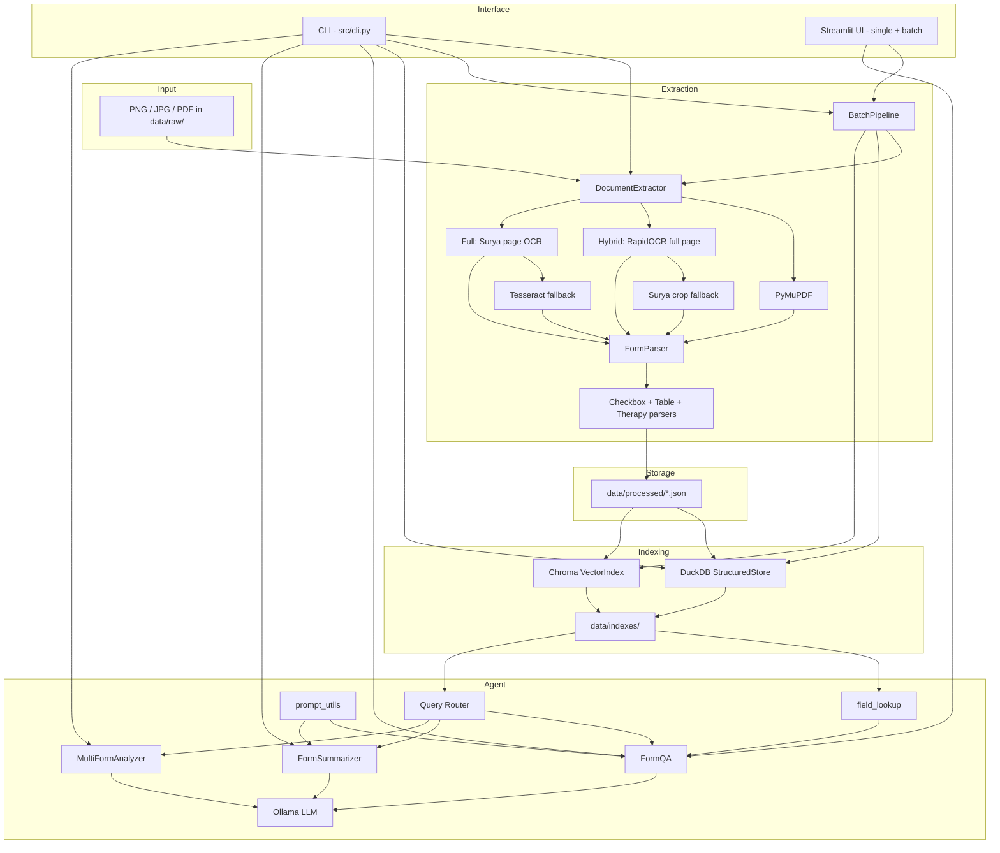
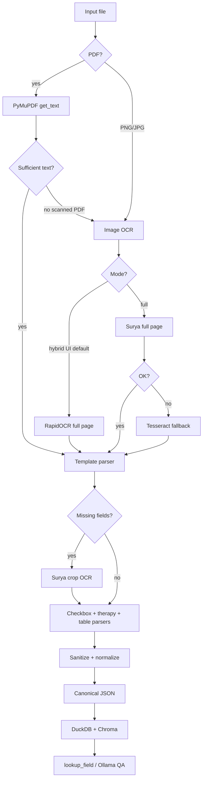

# Architecture

System architecture for the Intelligent Form Agent.

## High-level diagram



## Extraction priority



## Module responsibilities

| Module | Role |
|--------|------|
| `src/cli.py` | Typer CLI — extract, index, ask, reextract-below-confidence |
| `src/config/settings.py` | `.env` configuration |
| `src/ingest/loader.py` | List and load form files |
| `src/ingest/preprocess.py` | Image preprocessing (full + fast batch mode) |
| `src/extract/document_extractor.py` | Orchestrates PyMuPDF → hybrid/full OCR |
| `src/extract/ocr_engines.py` | OCR mode and fast-engine registry |
| `src/extract/region_ocr.py` | Fast crop OCR with Surya fallback |
| `src/extract/field_refiner.py` | Surya crop retry for missing critical fields |
| `src/extract/member_id_parser.py` | Layout-aware Member ID parsing |
| `src/extract/provider_parser.py` | Section IV two-column providers (requesting vs service) |
| `src/extract/form_parser.py` | Maps text to Section I–VI JSON schema |
| `src/extract/checkbox_detector.py` | Texas-form checkbox detection + text fallbacks |
| `src/extract/table_parser.py` | Procedure table extraction |
| `src/extract/therapy_parser.py` | Therapy sessions/duration + crop OCR |
| `src/extract/sanitize.py` | Strip placeholders; RapidOCR normalization |
| `src/pipeline/batch.py` | Batch extract/index with model reuse |
| `src/index/structured_store.py` | DuckDB for SQL analytics |
| `src/index/vector_index.py` | Chroma embeddings (no raw OCR chunks) |
| `src/agent/field_lookup.py` | Direct field answers (always first in Q&A) |
| `src/agent/prompt_utils.py` | LLM context without raw_text |
| `src/agent/router.py` | Query classification |
| `src/agent/qa.py` | Single-form Q&A |
| `src/agent/summarizer.py` | Form summaries |
| `src/agent/multi_form.py` | Cross-form analytics |
| `src/agent/llm_client.py` | Ollama HTTP client |
| `src/ui/app.py` | Streamlit UI (single + batch tabs, Hybrid/Full OCR selector) |
| `src/ui/summary_view.py` | Blue/white section-card summary renderer |

## Technology stack

| Layer | Technology | Purpose |
|-------|------------|---------|
| Fast OCR | RapidOCR (default), PaddleOCR, EasyOCR | Full-page text in hybrid mode |
| Accurate OCR | Surya 0.4.5 (HuggingFace) | Full-page (full mode) or crop fallback (hybrid) |
| PDF | PyMuPDF | Embedded text extraction |
| OCR fallback | Tesseract | Legacy crop + Surya failure |
| Schema | Pydantic v2 | Validated JSON output |
| Embeddings | sentence-transformers | Local vector embeddings |
| Vector DB | Chroma | Persistent semantic search |
| Analytics DB | DuckDB | SQL over structured fields |
| LLM | Ollama (llama3.1:8b) | Q&A, summaries, analytics |
| CLI | Typer + Rich | Command-line interface |
| UI | Streamlit | Single-form + batch upload UI |

## Data flow

```text
data/raw/<form>.png
    ↓ extract (OCR + parse + sanitize)
data/processed/<form_id>.json
    ↓ index (upsert_many + index_forms)
data/indexes/forms.duckdb  +  data/indexes/chroma/
    ↓ lookup_field (first) → ask / summarize / analyze-all
Terminal or Streamlit answer
```

## Design decisions

| Decision | Rationale |
|----------|-----------|
| Fully local stack | No API keys, privacy, offline after first download |
| Separate extract/index/agent stages | Re-run expensive OCR once; iterate on parser/QA independently |
| Dual indexing (DuckDB + Chroma) | SQL for aggregates, vectors for semantic Q&A |
| No raw OCR in vector index / LLM | Prevents contradictory answers from checkbox noise |
| `lookup_field` always first | Authoritative structured JSON beats LLM for known fields |
| `--no-llm` flag | Test extraction without LLM; offline demos |
| Hybrid OCR default in UI | ~1–2 min/form vs 30+ min full Surya; crops only when needed |
| BatchPipeline model reuse | One Surya load for multi-form extract in UI/CLI |
| Pydantic schema | Type-safe JSON, easy validation and extension |

## HuggingFace dependencies

```bash
export HF_HUB_DISABLE_XET=1
python -m src.cli download-models
```

## Related docs

- [Design Document](design.md) — goals and design rationale
- [End-to-End Flow](end-to-end-flow.md) — step-by-step pipeline walkthrough
- [Code Walkthrough](code-walkthrough.md) — file-by-file source guide
- [Extraction Pipeline](extraction-pipeline.md) — OCR and parsing details
- [Indexing & Retrieval](indexing-and-retrieval.md) — DuckDB + Chroma
- [Agent Layer](agent-layer.md) — Q&A and analytics
- [UI Guide](ui-guide.md) — Streamlit single-form and batch interface
