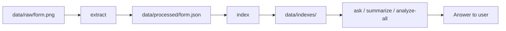

# End-to-End Flow

This document walks through the complete journey from a raw form image to a final answer. Read this after the [Design Document](design.md) to understand *how* the system works in practice.

## Overview



Pipeline stages and commands:

| Command | Stage | Input | Output |
|---------|-------|-------|--------|
| `extract` | Extraction | `data/raw/*.png` | `data/processed/*.json` |
| `reextract-below-confidence` | Re-extraction | low-confidence JSON | updated JSON + re-index |
| `index` | Indexing | `data/processed/*.json` | `data/indexes/` |
| `ask` / `summarize` / `analyze-all` | Agent | indexes + JSON | terminal answer |

**Streamlit UI** (`make ui`) runs extract + index + Q&A in the browser with single-form and batch tabs.

---

## Stage 1: Extract

**Command:** `python -m src.cli extract --input data/raw`

### What happens

1. **List files** — `src/ingest/loader.py` finds all supported files in `data/raw/`
2. **For each file:**
   - Skip if `data/processed/<form_id>.json` exists (unless `--force`)
   - Run `FormParser.parse_file()`
3. **Write JSON** — one `FormDocument` per form saved to `data/processed/`

### Inside FormParser

```text
FormParser.parse_file()
  └── DocumentExtractor.extract()     # get text from image/PDF
        ├── PDF? → PyMuPDF text first
        │         └── insufficient text? → hybrid or full OCR
        └── Image? → hybrid (default in UI) or full OCR
              ├── hybrid: RapidOCR full page → parse
              │         └── field_refiner: Surya crops for missing fields
              └── full: Surya full page → Tesseract fallback on failure
  └── parse_content()                 # regex + sections → FormDocument
        ├── section slicing (I–VI)
        ├── RapidOCR text normalization (names, codes, dates)
        ├── member ID layout-aware parsing
        ├── Texas checkbox detection (OpenCV + text fallbacks)
        ├── procedure table parsing (year-as-code rejection)
        ├── therapy sessions (text + hybrid crop OCR)
        ├── OCR sanitization
        └── confidence score
```

### Example output

```json
{
  "form_id": "0a01f77b-85f9-48c9-89bf-4b095bebb438_TX_page_1",
  "section_iii_patient": { "name": "Daniel Jarvis", "gender": "unknown" },
  "section_v_services": {
    "setting": "outpatient",
    "therapies": [{ "therapy_type": "physical_therapy", "sessions": 4, "duration": "2 weeks" }],
    "procedures": [{ "code": "44300", "icd_code": "Z47.1" }]
  },
  "extraction_method": "hybrid:rapidocr+surya-crops",
  "extraction_confidence": 1.0
}
```

**Validate extraction:** open the JSON and compare fields to the source PNG.

---

## Stage 1b: Re-extract low confidence

**Command:** `python -m src.cli reextract-below-confidence --threshold 1.0`

Re-OCRs only forms with `extraction_confidence` below the threshold, then re-indexes all processed JSON via `BatchPipeline`.

---

## Stage 2: Index

**Command:** `python -m src.cli index`

### What happens

For all JSON in `data/processed/`:

1. **DuckDB batch upsert** (`StructuredStore.upsert_many`)
   - Flattens key fields into `forms` table
   - Inserts procedure rows into `procedures` table

2. **Chroma batch index** (`VectorIndex.index_forms`)
   - Chunks form into structured sections (patient, setting, therapy, procedures — **no raw OCR**)
   - Single batched embedding pass with `all-MiniLM-L6-v2`
   - Stores in `data/indexes/chroma/`

### Why index separately?

- Re-run indexing after parser fixes without re-OCR
- DuckDB powers SQL analytics; Chroma powers semantic Q&A
- Agent queries use both stores together

---

## Stage 3: Ask (single-form Q&A)

**Command:** `python -m src.cli ask "QUESTION" --form <form_id>`

### What happens

```text
ask command
  ├── Load FormDocument from data/processed/<form_id>.json
  ├── Open DuckDB + Chroma indexes
  └── FormQA.answer()
        ├── lookup_field() → direct answer if matched (ALWAYS first)
        ├── classify_query() → semantic | aggregate
        ├── vector_index.search() → top 5 chunks (no raw OCR)
        ├── build prompt: chunks + key_fields_summary + JSON (no raw_text)
        └── OllamaClient.generate() → natural language answer
```

### With `--no-llm`

Only `lookup_field()` runs. Covers setting, therapy, gender, patient, providers, procedures, and more. No Ollama required.

---

## Stage 4: Summarize

**Command:** `python -m src.cli summarize --form <form_id>`

Uses `form_context_for_llm()` — structured JSON without raw OCR text.

**Without LLM** (`--no-llm`): `summarize_structured()` returns sectioned markdown (Patient, Request, Providers, Services) with human-readable labels and formatted dates.

**Streamlit UI:** Click **Summarize** to render blue/white section cards via `src/ui/summary_view.py`. Summary appears below the Ask / Summarize buttons (Patient card includes Member ID). Re-extract clears the cached summary.

---

## Stage 5: Analyze-all (multi-form)

**Command:** `python -m src.cli analyze-all --question "..."`

`default_stats()` includes review type, request type, **setting counts**, top providers, and procedure samples.

Also available in Streamlit **Batch upload & analyze** tab.

---

## Stage 6: Streamlit UI

**Command:** `make ui` → http://localhost:8501 (use another port if 8501 is busy, e.g. `--server.port 8502`)

| Tab | Features |
|-----|----------|
| Single form | Upload → extract (Hybrid/Full OCR selector) → metrics → JSON → Q&A → **Summarize** (cards below buttons) |
| Batch upload & analyze | Multi-file upload, skip-existing, force re-extract, **Forms in index** table (with `member_id`), holistic analysis, per-form Q&A |

**Extraction settings** (sidebar container): **Hybrid** (default, RapidOCR + Surya crops) or **Full** (Surya full page). Parser cache version bumps require re-extract to pick up parser fixes.

Cached OCR and embedding models (`@st.cache_resource`). Direct lookup works without Ollama.

---

## Data directory layout

```text
data/
├── raw/                          # Your input forms
├── processed/                    # Extracted JSON (source of truth)
└── indexes/
    ├── forms.duckdb              # Structured SQL database
    └── chroma/                   # Vector embedding store
```

---

## Typical timing (11 PNG forms, Apple Silicon)

| Step | Hybrid (UI default) | Full Surya |
|------|---------------------|------------|
| `download-models` | ~1 min (first run) | ~1 min |
| Single form extract (UI) | ~1–2 min | ~3–30+ min |
| `extract` CLI (all 11, full) | — | ~60–90 min |
| `extract` / batch UI (11, hybrid) | ~15–25 min | ~60–90 min |
| `reextract-below-confidence` | ~1–2 min/form (hybrid) | ~3–10 min/form |
| `index` (batch) | ~10 sec | ~10 sec |
| `ask` (lookup) | instant | instant |
| `ask` (LLM) | ~5–15 sec | ~5–15 sec |

---

## How to trace a question through the system

**Example:** `ask "is he inpatient or outpatient" --form 0a01f77b-... --no-llm`

1. CLI loads JSON → `section_v_services.setting: "outpatient"`
2. `lookup_field()` matches setting pattern (checked before gender)
3. Answer: *"Service setting: outpatient (Section V)"*
4. No vector search, no LLM

**Ground truth check:** `cat data/processed/<form_id>.json | python -m json.tool | grep setting`

---

## Related docs

- [Extraction Pipeline](extraction-pipeline.md) — OCR and parsing details
- [Indexing & Retrieval](indexing-and-retrieval.md) — DuckDB and Chroma internals
- [Agent Layer](agent-layer.md) — Q&A, summary, analytics logic
- [Validation Guide](validation-guide.md) — verify answers are correct
