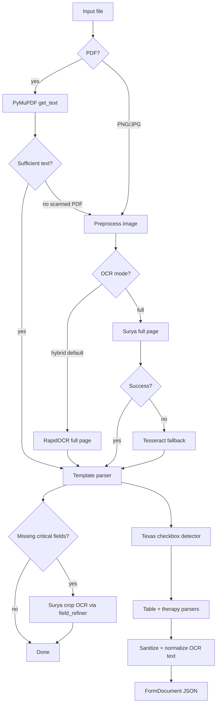

# Extraction Pipeline

How raw form images and PDFs become structured JSON. This is **Stage 1** of the pipeline.

## Pipeline diagram



## Module map

| File | Responsibility |
|------|----------------|
| `src/ingest/loader.py` | List and load image/PDF files |
| `src/ingest/preprocess.py` | Image normalization (full + fast batch mode) |
| `src/extract/document_extractor.py` | Orchestrates PyMuPDF → hybrid/full OCR |
| `src/extract/pdf_extractor.py` | PyMuPDF embedded text extraction |
| `src/extract/ocr_engine.py` | Surya, Tesseract, RapidOCR/Paddle/Easy crop OCR |
| `src/extract/ocr_engines.py` | OCR mode registry (hybrid vs full, engine labels) |
| `src/extract/region_ocr.py` | `RegionOCRReader`: fast crop OCR → Surya fallback |
| `src/extract/field_refiner.py` | Surya crop retry for missing critical fields |
| `src/extract/member_id_parser.py` | Layout-aware Member ID vs Group # assignment |
| `src/extract/hf_utils.py` | HuggingFace model download/cache checks |
| `src/extract/form_parser.py` | Text → Section I–VI JSON |
| `src/extract/checkbox_detector.py` | Texas-form checkbox detection + text fallbacks |
| `src/extract/table_parser.py` | Procedure table row extraction |
| `src/extract/therapy_parser.py` | Therapy sessions/duration + crop OCR |
| `src/extract/sanitize.py` | Strip placeholders; RapidOCR text normalization |
| `src/extract/schema.py` | Pydantic data models |
| `src/pipeline/batch.py` | Batch extract with model reuse |

---

## Step 1: File loading

`list_form_files(input_dir)` returns sorted paths with extensions:
`.png`, `.jpg`, `.jpeg`, `.tiff`, `.tif`, `.pdf`

Form ID = filename stem (e.g. `0a01f77b-85f9-48c9-89bf-4b095bebb438_TX_page_1`).

---

## Step 2: Document extraction

`DocumentExtractor.extract(path)` chooses a method. The Streamlit UI defaults to **hybrid** mode; CLI `extract` uses full Surya unless configured via `FormParser`.

### PDF files
1. `extract_pdf_text()` via PyMuPDF
2. If text length ≥ `PDF_MIN_TEXT_CHARS` (default 100) → use PyMuPDF result
3. Otherwise → render page to image → hybrid or full OCR (see below)

### Image files (PNG, JPG, etc.)

**Hybrid mode** (`ocr_mode="hybrid"`) — default in Streamlit UI:
1. `load_image()` → RGB PIL Image
2. RapidOCR (or PaddleOCR / EasyOCR) on the **full page** for layout text (~seconds)
3. Template parse from fast OCR text
4. `field_refiner` runs **Surya crop OCR** only on missing critical fields (member ID, DOB, NPI, sessions, etc.)
5. Never runs full-page Surya in hybrid mode

**Full mode** (`ocr_mode="full"`):
1. `load_image()` → preprocess → Surya full-page OCR
2. On failure → optional Tesseract fallback

Typical timing: **~1–2 min/form** (hybrid) vs **~3–30+ min/form** (full Surya per page).

### OCR warmup
`OCREngine.warmup()` loads Surya models once before batch processing (full mode or hybrid crop fallback).

---

## Step 3: Template parsing

`FormParser.parse_content()` maps OCR text to the canonical schema.

### Section-scoped parsing

Each section (I–VI) is parsed independently to avoid cross-section field bleed.

### Texas checkbox detection

`detect_texas_form_fields()` in `checkbox_detector.py`:

| Field | Method |
|-------|--------|
| Review type | OpenCV ink when clear; then **label order before `Review Type:`** (only `Urgent` → urgent; `Non-Urgent` before spurious `Urgent` → non-urgent); checkbox band + text fallbacks |
| Request type | OpenCV + text fallback (`\| Extension` → initial) |
| Gender | Row-band scanning (Unknown label often missing from OCR) |
| Setting | Inpatient/outpatient; text fallback for `Inpatient ] Outpatient[` → outpatient |
| Therapies | OpenCV + inference when sessions/duration filled (e.g. physical therapy) |

**RapidOCR text fallbacks** apply only after OpenCV ink scores and label-order checks are inconclusive. Label order before `Review Type:` is authoritative when a lone `Urgent` appears (urgent) or `Non-Urgent` appears before a spurious `Urgent` (non-urgent). Text fallbacks such as spurious `Urgent` under Clinical Reason are a last resort — not the primary signal.

### Procedure table (`table_parser.py`)

- **CPT-anchored** rows for scrambled RapidOCR (excludes diagnosis bleed like `Othermotorcycle`)
- Date-line fallback for rows where CPT code is missing from OCR
- Groups OCR lines into rows by date lines
- Attaches trailing ICD-only lines to previous row
- Rejects bare years (2022, 2023) as CPT codes
- Normalizes mangled ICD: `.247.1` → `Z47.1`
- Skips column header lines (Start Date, Code, etc.)

### Therapy sessions (`therapy_parser.py`)

**Therapy type:** when checkboxes are ambiguous, `infer_therapy_from_session_column()` maps the session digit’s x-position between Physical (left) and Speech (right) labels — Occupational when the count sits in the middle column.

**Duration:** reads `1 week` / `2 weeks` from the therapy row; does not treat the bare session count after `Duration:` as duration.

OCR often misses handwritten session counts. Parser tries:
1. Inline text after "Number of Sessions:"
2. Standalone digit lines (e.g. `4`) — skips duration text like `2 weeks`
3. Digit-only OCR lines near therapy row (spatial matching)
4. Hybrid crop OCR via `RegionOCRReader` (fast engine → Surya fallback)

**Does not** treat checkbox artifacts like `[ 2 Physical Therapy` as session count.

### Section IV providers (`provider_parser.py`)

Texas forms use a **two-column layout** (Requesting left, Service right). `parse_section_iv_providers()`:

| Field | Method |
|-------|--------|
| Column split | Midpoint from **header** labels (`Requesting Provider or Facility` / `Service Provider or Facility`) |
| Name | First name row per column (y-offset from header) |
| NPI | 9–10 digit value in column |
| Phone / Fax | Nearest number to `Phone:` / `Fax:` label in same column |
| Contact / PCP | Name near `Contact Name` / `Primary Care Provider` label |

Avoids reversing providers when RapidOCR reads the service column before the requesting column.

### Member ID (`member_id_parser.py`)

RapidOCR often places `62106` under the Member ID column while a regex steals it as `group_number`. Fix:
- Spatial column assignment (x-center of digits vs Member vs Group labels)
- Image crop OCR fallback when text parse misses the value

### OCR sanitization and normalization (`sanitize.py`)

| Field | Stripped values |
|-------|-----------------|
| `clinical_reason_for_urgency` | `\| Urgent` (OCR artifact) |
| `subscriber_name` | `(if different):` |
| `prev_auth_number` | `SECTION`, values without digits |

**RapidOCR / hybrid normalization** (`uses_fast_ocr_normalization()`):
- Section slicing by content keywords (`patient information`, `provider information`, etc.)
- CamelCase name splitting (`ElizabethFoley` → `Elizabeth Foley`)
- Mashed code/date splitting (`4430011/20/2022` → `44300 11/20/2022`)

### Other parser improvements

- Issuer name from health-plan lines (e.g. "Molina Healthcare of Texas")
- Submission date from Section I (not confused with DOB)
- Section IV providers via `provider_parser.py` — two-column layout, label-proximity phone/fax, contact/PCP names
- Legacy NPI heuristic (`npis[1]`=requesting, `npis[0]`=service) only when column parsing cannot assign values
- DOB fix for OCR `0/DD/YYYY` → `03/DD/YYYY`
- Expanded confidence scoring (issuer, gender, setting, therapies, etc.)

---

## Step 4: Output schema

`FormDocument` in `src/extract/schema.py`:

```text
section_i_submission     → issuer, submission date
section_ii_general       → review_type, request_type, urgency reason
section_iii_patient      → name, DOB, gender, member_id, group_number
section_iv_providers     → requesting + service provider blocks
section_v_services       → setting, therapies[], procedures[]
section_vi_clinical      → address, notes
extraction_method        → hybrid:rapidocr+surya-crops | surya | pymupdf | tesseract
extraction_confidence    → 0.0–1.0 heuristic score
raw_text                 → full OCR text (stored but not sent to LLM/index)
```

---

## Confidence scoring

`extraction_confidence` is a heuristic based on populated key fields:

| Range | Meaning |
|-------|---------|
| 0.5–0.65 | Partial extraction |
| 0.65–0.85 | Good extraction |
| 0.85–1.0 | Most fields found (checkboxes, therapies, issuer, etc.) |

### Re-extract low-confidence forms

```bash
python -m src.cli reextract-below-confidence --threshold 1.0
```

Re-OCRs only forms below the threshold, then re-indexes all processed JSON.

---

## Tuning extraction quality

1. **Check raw OCR text** — field in `raw_text` of processed JSON?
2. **If missing from raw_text** → OCR issue (re-extract, image crop in `therapy_parser.py`)
3. **If present but null in structured fields** → parser regex issue
4. **Edit** the relevant parser module
5. **Re-run** `extract --force` or `reextract-below-confidence`, then `index`

---

## Related docs

- [Code Walkthrough](code-walkthrough.md) — all source files explained
- [Indexing & Retrieval](indexing-and-retrieval.md) — what happens after extraction
- [Troubleshooting](troubleshooting.md) — OCR and download issues
