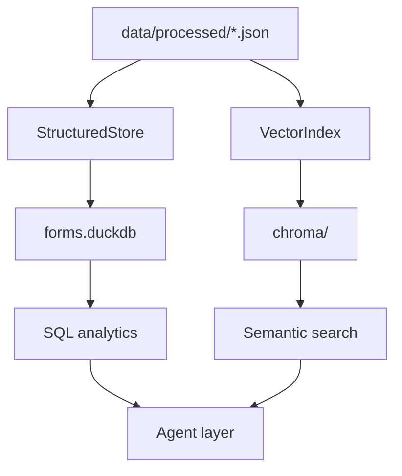

# Indexing & Retrieval

How extracted JSON is indexed for fast lookup and semantic search. This is **Stage 2** of the pipeline.

## Overview



**Command:** `python -m src.cli index`

Batch indexing uses `upsert_many()` + `index_forms()` for a single embedding pass.

---

## DuckDB structured store

**File:** `src/index/structured_store.py`  
**Database:** `data/indexes/forms.duckdb`

### Schema

**`forms` table** — one row per form:

| Column | Source |
|--------|--------|
| `form_id` | Primary key |
| `patient_name` | Section III |
| `member_id` | Section III |
| `review_type` | Section II (urgent / non_urgent) |
| `request_type` | Section II |
| `requesting_provider` | Section IV |
| `requesting_npi` | Section IV |
| `service_provider` | Section IV |
| `service_npi` | Section IV |
| `raw_json` | Full FormDocument JSON |

**`procedures` table** — one row per procedure:

| Column | Source |
|--------|--------|
| `form_id` | Foreign key |
| `code` | CPT/HCPCS code |
| `planned_service` | Description |
| `icd_code` | Diagnosis ICD |
| `start_date`, `end_date` | Service dates |

### Operations

```python
store = StructuredStore(settings.duckdb_path)
store.upsert(doc)              # insert or replace one form
store.upsert_many(docs)        # batch upsert in one transaction
store.query("SELECT ...")      # run SQL, return list of dicts
store.close()
```

### Used by

- `MultiFormAnalyzer.default_stats()` — cross-form SQL aggregates (including `setting_counts`)
- Streamlit batch tab — holistic analysis panel

---

## Chroma vector index

**File:** `src/index/vector_index.py`  
**Storage:** `data/indexes/chroma/`

### Embedding model

`sentence-transformers/all-MiniLM-L6-v2` (384-dimensional vectors)

### Chunking strategy

Each form is split into **structured semantic chunks** — raw OCR text is **not** indexed (prevents noisy retrieval like `Inpatient [7] Outpatient [7]`).

| Chunk ID | Content |
|----------|---------|
| `{form_id}_submission` | Submission date, issuer |
| `{form_id}_patient` | Name, DOB, member ID, gender, group number |
| `{form_id}_general` | Review type, request type |
| `{form_id}_requesting_provider` | Name, NPI, phone |
| `{form_id}_service_provider` | Name, NPI, phone |
| `{form_id}_setting` | Inpatient/outpatient service setting |
| `{form_id}_therapy_{i}` | Each therapy type, sessions, duration |
| `{form_id}_clinical` | Clinical address |
| `{form_id}_proc_{i}` | Each procedure row |

Legacy `{form_id}_raw` chunks from older indexes are filtered out at search time.

### Batch indexing

```python
vector_index.index_forms(docs)  # single encode() call for all chunks
```

Used by CLI `index`, `BatchPipeline`, and Streamlit batch tab.

### Search

```python
vector_index.search(query, form_id="...", top_k=5)
```

Returns top-k chunks by cosine similarity, optionally filtered to one form. Excludes `raw` section chunks.

---

## Re-indexing

Re-run indexing when:
- Parser rules change (re-extract first, then index)
- New forms added to `data/processed/`
- Embedding model changes (update `.env`, delete `data/indexes/chroma/`)

```bash
python -m src.cli index
# or targeted re-extract + re-index:
python -m src.cli reextract-below-confidence --threshold 1.0
```

Upsert is idempotent — existing form chunks are deleted and replaced.

---

## How retrieval supports Q&A

When you ask: *"What therapies are requested?"*

1. `lookup_field()` may answer directly from structured JSON
2. Otherwise `VectorIndex.search()` finds therapy/setting chunks
3. LLM receives chunks + **key fields summary** + structured JSON (**no raw_text**)

When you ask: *"Is he inpatient or outpatient?"*

1. `lookup_field()` returns `setting: outpatient` from Section V — **no LLM needed**
2. Works with `--no-llm` and in Streamlit without Ollama running

---

## Related docs

- [Agent Layer](agent-layer.md) — how indexes feed Q&A and analytics
- [End-to-End Flow](end-to-end-flow.md) — where indexing fits in the pipeline
- [Validation Guide](validation-guide.md) — verify retrieval quality
